# Agentic Workflow for System Trimming

An intelligent, agent-based framework for computing equilibrium points (trim conditions) of nonlinear dynamic systems, performing linearization, stability analysis, and constraint validation. This project demonstrates multi-agent collaboration in scientific computing, inspired by modern AI workflows.

**Author**: Mahdi Sarfarazi  
**Repository**: https://github.com/mahdisf/agentic-workflow-trimming

## Features

- **Multi-Agent Architecture**: Planner, Solver, and Analysis agents work collaboratively
- **System Support**:
  - Mass-Spring-Damper (1-DOF)
  - 2-DOF Helicopter
  - Aircraft Longitudinal Dynamics
- **Comprehensive Analysis**:
  - Equilibrium point computation
  - Linearization via numerical Jacobian
  - Stability analysis (eigenvalue-based)
  - Constraint validation
- **Visualization**: Time-domain simulation plots
- **Trace Logging**: Detailed execution trace for debugging and analysis

## Installation

1. Clone the repository:
   ```bash
   git clone https://github.com/mahdisf/agentic-workflow-trimming.git
   cd agentic-workflow-trimming
   ```

2. Install dependencies:
   ```bash
   pip install -r requirements.txt
   ```

## Usage

Run the main script:
```bash
python agentic_workfollow.py
```

The program will prompt you to select a system and configure parameters:

1. **System Selection**: Choose from MSD, Helicopter, or Aircraft
2. **Parameter Configuration**: Set system parameters and operating conditions
3. **Workflow Execution**:
   - Planner Agent determines initial guess and strategy
   - Solver Agent finds equilibrium iteratively
   - Analysis Agent performs linearization and validation
4. **Results**: View equilibrium points, stability classification, and eigenvalues
5. **Visualization**: Optionally generate time response plots

## Example Output

```
============================================================
AGENTIC WORKFLOW FOR SYSTEM TRIMMING
============================================================

Available Systems:
1. Mass-Spring-Damper (1-DOF)
2. 2-DOF Helicopter
3. Aircraft Longitudinal Dynamics

Select system (1-3): 1

--- Mass-Spring-Damper Configuration ---
Desired equilibrium force [default=1.0]: 2.0

------------------------------------------------------------
WORKFLOW EXECUTION
------------------------------------------------------------

[1/3] Planner Agent: Determining strategy...
  → Initial guess: [2.0, 0.0, 2.0]
  → Strategy: minimize

[2/3] Solver Agent: Finding equilibrium...
Attempt 0: cost=0.0, success=True, message=CONVERGENCE: NORM_OF_PROJECTED_GRADIENT_<=_PGTOL
  ✓ Converged!
  → x_e = [2. 0.]
  → u_e = [2.]

[3/3] Analysis Agent: Linearization and validation...
  → Stability: asymptotically stable
  → Eigenvalues: [-0.500000, -0.500000]
  → Feasible: True

============================================================
RESULTS
============================================================

System: msd

Equilibrium Point:
  position [m]: 2.000000
  velocity [m/s]: 0.000000

Equilibrium Inputs:
  force [N]: 2.000000

Stability Analysis:
  Classification: asymptotically stable
  Eigenvalues: ['-0.500000', '-0.500000']

Diagnostics:
  Converged: True
  Feasible: True

Result saved to: results/msd_result.json

------------------------------------------------------------
SIMULATION
------------------------------------------------------------

Generate time response plot? (y/n) [default=y]: y
  → Plot saved to results/msd_response.png
```

## Workflow Overview

```mermaid
flowchart TD
    A[🚀 **Start**] --> U[👤 **User Inputs**<br>**System Choice**, Params]
    U --> B{🤖 **ParserAgent**<br>**Configure System**}
    B --> C[⚙️ **Config**: System, f, Params, Bounds]
    C --> D[📋 **PlannerAgent**<br>**Initial Guess** & Strategy]
    D --> E[🔧 **SolverAgent**<br>**Iterative Solve**]
    E --> F{✅ **Converged?**}
    F -->|No| G[❌ **Error**: No Convergence]
    F -->|Yes| H[📊 **AnalysisAgent**<br>**Linearization** & Stability]
    H --> I[📄 **Generate JSON Output**]
    I --> K[📈 **Optional**: Simulate & Plot<br>**User Prompt** for Plot]
    K --> L[🏁 **End**]

    subgraph **Agents**
        B
        D
        E
        H
    end

    subgraph **Tools**
        T1[solve_equilibrium] --> E
        T2[compute_jacobian] --> H
        T3[analyze_stability] --> H
        T4[validate_constraints] --> H
    end

    classDef agent fill:#AED6F1,stroke:#3498DB,stroke-width:2px,color:#000
    classDef tool fill:#ABEBC6,stroke:#27AE60,stroke-width:2px,color:#000
    classDef startend fill:#FAD7A0,stroke:#D68910,stroke-width:2px,color:#000
    classDef decision fill:#C0392B,stroke:#C0392B,stroke-width:2px,color:#000
    classDef user fill:#D7BDE2,stroke:#8E44AD,stroke-width:2px,color:#000

    class A,L startend
    class F decision
    class B,D,E,H agent
    class T1,T2,T3,T4 tool
    class U user
```



## Project Structure

```
agentic-workflow-trimming/
├── agentic_workfollow.py    # Main workflow script
├── agents.py                # Agent classes and tools
├── requirements.txt         # Python dependencies
├── .gitignore              # Git ignore rules
├── README.md               # This file
├── workflow_flowchart.mmd  # Mermaid diagram of workflow
└── results/                # Output directory
    ├── *_result.json       # Analysis results
    └── *_response.png      # Simulation plots
```

## Dependencies

- **numpy**: Numerical computing
- **scipy**: Scientific computing (optimization, integration)
- **matplotlib**: Plotting and visualization

## License

MIT License - see LICENSE file for details
